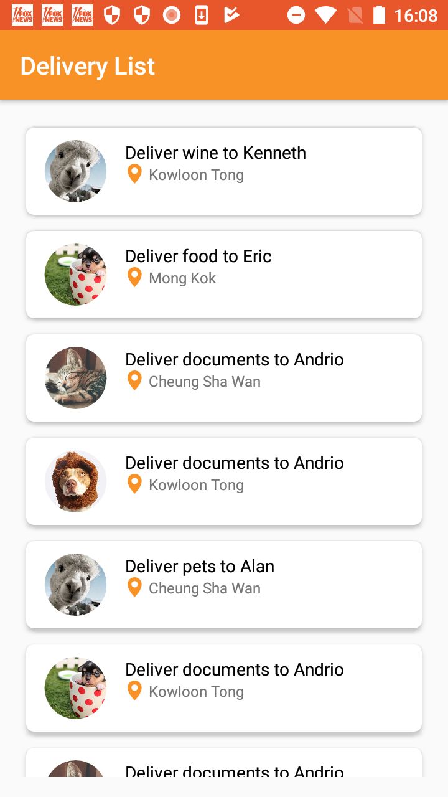
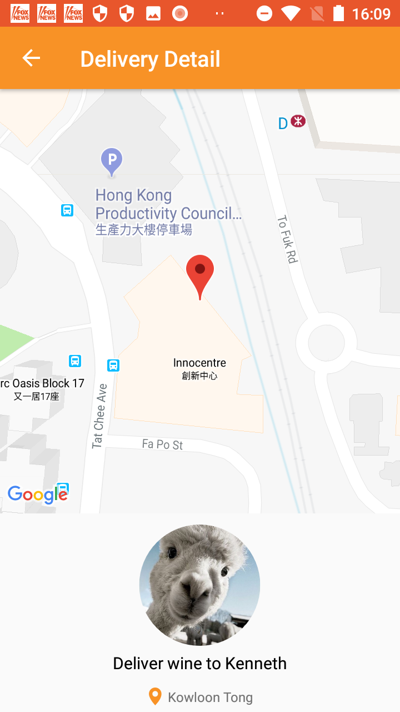

# Delivery-App

**Special Note - Here I developed this code using two Git Profiles.That is because I was using two Git Profiles( machine and Personal) to develop this code. So please neglect that issue.**

**What are the features that the given application provide**

1) Lordmore feature(Pagination) - user do not need to featch whole dataset at once.
2) Offline feature - Without network connectivity user can get the data
3) Display list of deliveries.
4) Show details when user select an item in the list
5) Add marker on the map based on the provided lat/lng

**Libraries which I used to built this application**

1) Retrofit2 
2) de.hdodenhof:circleimageview:2.2.0 
3) com.squareup.picasso:picasso:2.71828 
4) com.android.support:recyclerview-v7:27.0.2 
5) com.android.support:cardview-v7:27.0.2 

**Approach**

1) Design UI to create pages for the Delivery Application
2) Application has mainly two activities MainActivity,DetailsActivity
3) For DetailActivity I used Google Map Activity to generate Google Map .I added google map key in side the **google_maps_api.xml**.We can use with other key when we change the google_maps_api.xml.
4) To communicate with node server I used Retrofit library.It handled cache .
5) RecycleView and CardView used to show data.

** Here I added Screeenshots of the Application **

